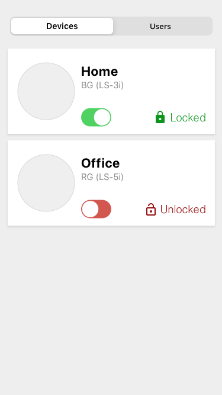
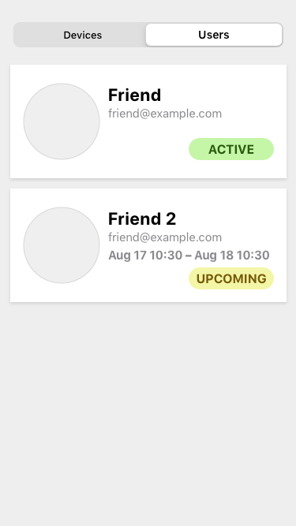

# Frontend Engineer Code Exercise

# Terminology

- _Device_: A WiFi-enabled lock, connected to the Internet, which can be viewed and controlled via the app UI.
- _Access User_: A person who can permanently access doors which are protected with a smart lock. Each user has their own PIN which can be entered via the lock's keypad to unlock it.
- _Access Guest_: A person who can access doors protected with a smart lock for a certain date and time range.
- _Access Person_: An access user or guest.

# Exercise

### Develop a mobile-first mini web app using React with 2 pages, similar to these mockups:

### API

The app should fetch the data from an static API served by a local HTTP server.

Run the server with the command: `node api_server.js`

This server will expose two endpoints:

- Users: http://localhost:4000/api/users.json

- Devices: http://localhost:4000/api/devices.json

# What's Important

The goal of this challenge is to show familiarity with frontend development concepts and ecosystem as well as good general programming patterns. As such, we feel the following are important:

- Clarity/Readability: Is the intent of the code obvious? Are things named
  appropriately? Please void overly clever solutions.
- Maintainability: How flexible is the code?
- The UI is organized in terms of components
- Responsive, mobile-first pages. The web app should adapt to mobile and desktop
  screen sizes.
- The toggle in the device tile should work and maintain the state and cause
  other details in the tile to update.
- Code should use React to render the UI
- The body of the pull request gives a high level overview of your solution

# Bonus points

- Use React Native **only if you want and are profficient on it**, in which case
  it doesn't need to be responsive to support desktop view.
- The submission includes unit or integration tests

# What's Not Important

- Pixel-perfect design. Remember, these are just mock-ups. Feel free to customize the look and feel to your own taste.
- Choice of CSS methodology, library or framework. You can use whatever you are familiar with. CSS Modules, Sass or any CSS-in-JS library are accepted.
- Feel free to reach to any UI component or utility library to get the job done. No need to re-invent the wheel. Although for trivial stuff, you should feel comfortable writing the code yourself.
- Typed vs untyped JS (Flow, TypeScript and plain JS are all accepted)

# How to Submit the Exercise

- Fork the repository
- Create a new branch. Commit your solution on this branch.
- Push the branch to your fork and open a Pull Request
- When your Pull Request is ready for review, respond to our last email thread
  with the link to your Pull Request
